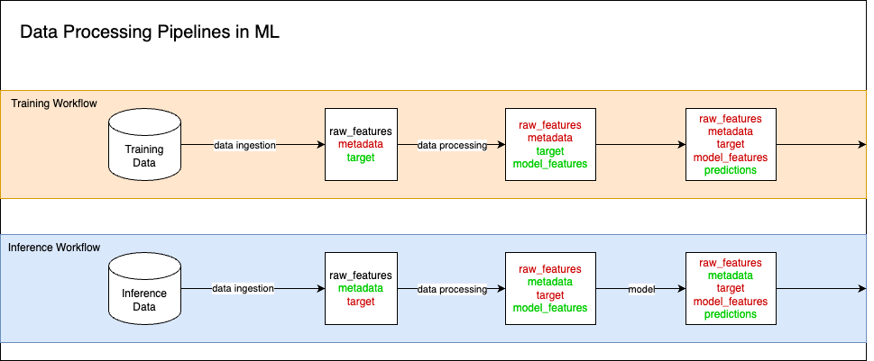

# Smart Pandas


`smart-pandas` is a Pandas api extension for defining machine learning data schemas, via a config file and the open source Pandera package, for Pandas dataframes. The goal of the package is to simplify the data flow for end to end ML pipelines by having clear definitions for columns, and allowing easy accessability of column groups at all times.

Data validation is an important part of any data intesive application, and that includes machine learning projects. However most schema frameworks lack the flexibiltiy and complexity to appropriately define schemas for ML datasets. There are two main considerations for data in the ML world:

1. The data schema may vary slightly depending on which stage of the ML lifecycle you are in. Are you training your ML model, or are you generating predictions in a deployed service?
2. Data columns fall into semantic groupings in the ML world, such as 'features', 'target(s)', 'weights', etc. which are not captured by traditional data schemas.

`smart-pandas` offers a way to cleanly answer those questions with a single schema, rather than having to build multiple schemas for various stages of the project.



The diagram above shows a simple example of the different 'groups' of columns you may want moving through your ML data pipeline. Those groups can vary from stage to stage, and can even be different depending on which ML lifecycle stage you're at.


## Basic Usage

To use `smart-pandas`, all you need to do is swap your Pandas import to use `smart-pandas`, which will give you access to the `smart-pandas` api extension.

```python
from smart_pandas imnport pandas as pd
```
Next, you need to define your config as a `.yaml` file. The config contains definitions for each column in your datast. See the config documentation for more details on building your own config.

```yaml
{
  name: "life_expectancy_modelling_data",
  columns: [
    {
      name: "user_id",
      schema: {"dtype": "str"},
      tags: ["unique_identifier"],
      description: "Unique identifier for the person"
    },
    {
      name: "timestamp",
      schema: {"dtype": "datetime"},
      tags: ["row_timestamp"],
      description: "Timestamp of the data"
    },
    {
      name: "name",
      schema: {"dtype": "str"},
      tags: ["metadata"],
      description: "Name of the person"
    },
    {
      name: "weight",
      schema: {"dtype": "float"},
      tags: ["raw_feature"],
      description: "Weight of the person in kg"
    },
    {
      name: "height",
      schema: {"dtype": "float"},
      tags: ["raw_feature"],
      description: "Height of the person in cm"
    },
    {
      name: "age",
      schema: {"dtype": "int"},
      tags: ["raw_feature", "model_feature"],
      description: "Age of the person in years"
    },
    {
      name: "bmi",
      schema: {"dtype": "float"},
      tags: ["derived_feature", "model_feature"],
      description: "BMI of the person"
    },
    {
      name: "life_expectancy",
      schema: {"dtype": "int"},
      tags: ["target"],
      description: "Life expectancy of the person in years"
    },
  ]
}
```

Then you can initialise your `smart-pandas` config with your pandas dataframe, and begin accessing the `smart-pandas` attributes.

```python
data = pd.DataFrame(
    {
        "user_id": ["1", "2", "3"],
        "timestamp": [pd.Timestamp("2020-01-01"), pd.Timestamp("2020-01-02"), pd.Timestamp("2020-01-03")],
        "name": ["Emily", "Adam", "Charles"],
        "weight": [60, 74, 80],
        "height": [165, 182, 185],
        "age": [25, 30, 35],
        "life_expectancy": [90, 80, 80],
    }
)
data.smart_pandas.init(config_path="examples/example_config.yaml")

print(data.smart_pandas.raw_features)

#
#        weight  height  age
# 0      78     180   31
# 1      74     182   31
# 2      80     185   34
#
```

## State
`smart-pandas` tracks the synchronisation between the data columns and the configuration file through the `state` attribute. The `state` attribute represents the data at certain phases in the ML data lifecycle. The state is built up of two attributes, the `StateName` and the `MLStage`. The `StateName` represents the current point in a specific data pipeline, whereas the `MLStage` identifies which data pipeline we are in.

```python
data.smart_pandas.state

# StateName.RAW, MLStage.TRAINING
```

## Data Validation
`smart-pandas` uses Pandera for building data schemas to validate the data against.

```python
data.smart_pandas.validate(inplace=True)
```

## Development
The package uses uv for it's package management, and pytest for it's unit test framework. To run unit-tests, use the following code:

```shell
uv run pytest tests/.
```

