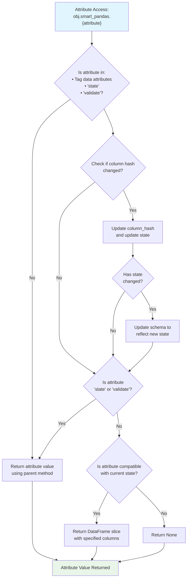

# State Management in Smart Pandas

## Overview

The state management system in Smart Pandas provides a way to track and understand where your data is in the processing pipeline. The `State` class automatically infers the current state of your data by analyzing the relationship between the columns present in your DataFrame and the columns specified in your configuration.

This system is particularly valuable for:
- **Pipeline Validation**: Ensuring data is in the expected state before processing
- **Error Detection**: Identifying corrupted or incomplete datasets

The state is built up of two attributes, the `StateName` and the `MLStage`.

### State Names

The `StateName` defines the different stages which your data can exist in:

- **RAW**: Data contains all original features but none of the derived features. This is the initial state of the data.
-  **PROCESSED**: Data contains all model features. This is considered the end stage prior to model training/predicitons.
- **UNKNOWN**: Data contains a combination of raw, derived, and model features. This represents an intermediate state between the raw and processed states. Feature engineering is still required to get to the processed state.
- **CORRUPTED**: Data is missing critical columns or has structural issues. For example, the data is missing the unique identifier column (which is a required column for all data).

### ML Stages

The `MLStage` defines the machine learning pipeline context:

- **TRAINING**: Data includes target variable and is suitable for model training
- **INFERENCE**: Data lacks target variable and is prepared for generating predictions at inference


## Integration with Smart Pandas

By default the state system is automatically managed by `smart-pandas`. An initial state is set when the `load_config` method is called, and then is updated upon calling any of the following:
- When accessing any data attribute groupings defined by the tags, eg: `data.smart_pandas.raw_features`
- When calling the `validate` method used to validate against the pandera schema, eg: `data.smart_pandas.validate()`
- When checking the `state` attribute, eg: `data.smart_pandas.state`

Note: The automated updating of state can be turned off by setting the `auto_update` parameter to `False` when calling the `load_config` method. Eg:

```python
data.smart_pandas.load_config(config_path="examples/example_config.yaml", auto_update=False)
```

This will improve performance and might be worthwhile for production environments. When data columns are updated, you can manually update the state by calling the `update` method, eg:

```python
data.smart_pandas.update()
```

The diagram below shows the process flow that `smart-pandas` uses to automatically update the state when `auto_update=True`.


